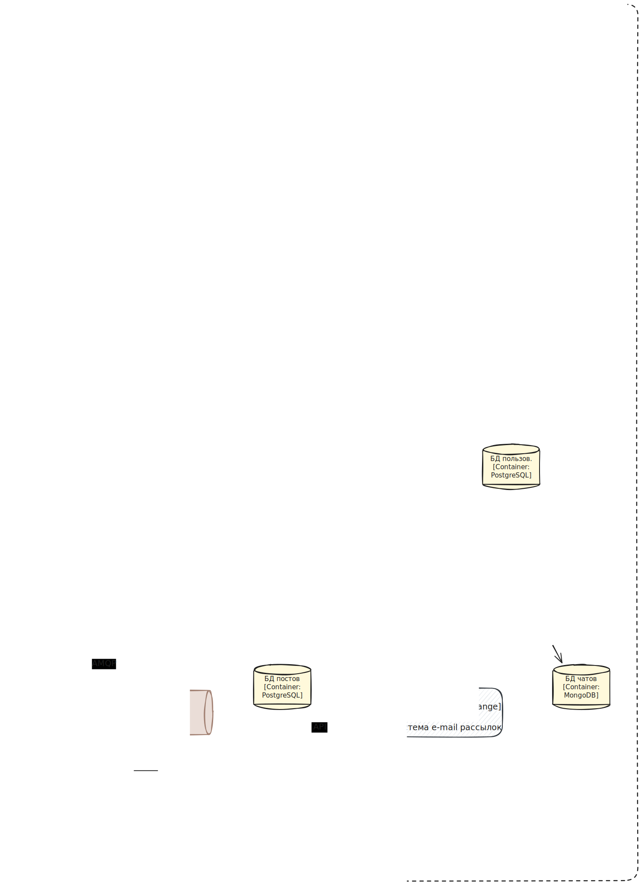
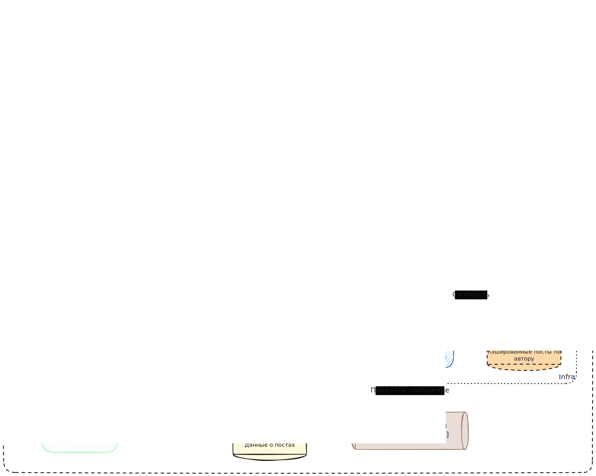
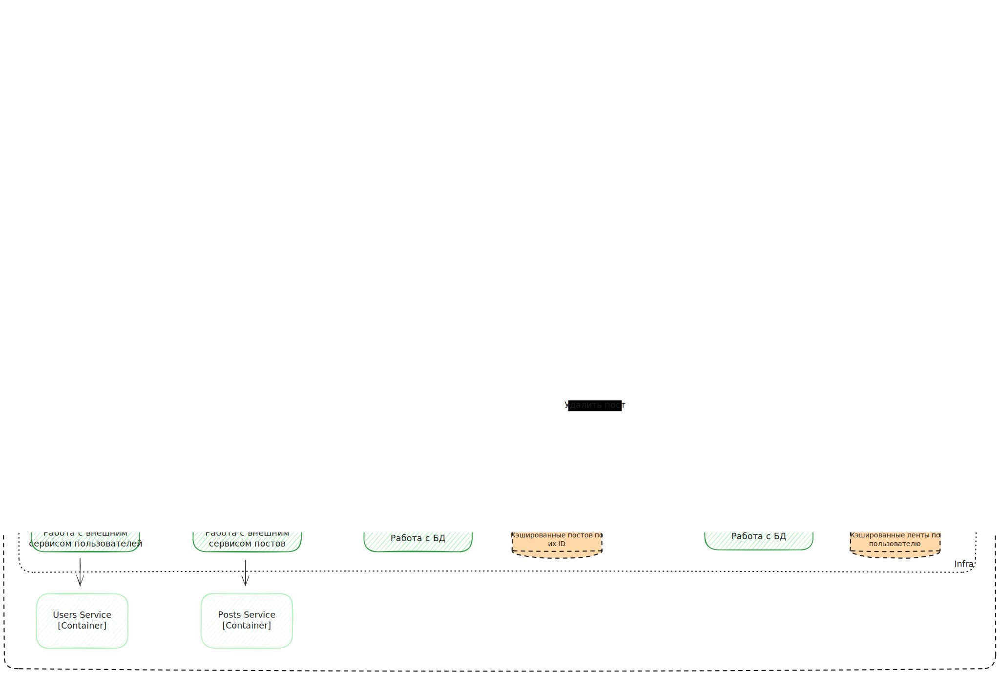

# ADR-001: Эволюция архитектуры сервиса постов

**Статус:** Согласовано\
**Дата:** 20.10.2025

## Контекст

Текущий Posts Service представляет собой микросервис, который отвечает за CRUD-операции с постами и формирование ленты. Это уже создает
нагрузку на сервис и нарушает принцип единой ответственности (SRP).

Бизнес выдвигает новые требования: лента постов должна обновляться в режиме реального времени для онлайн-пользователей. Это требует
введения механизма push-уведомлений (например, через WebSockets).

## Изложение проблемы

Как добавить функциональность реального времени в систему, не усугубляя нарушения SRP в текущем Posts Service и обеспечив доставку событий
только целевым пользователям, в условиях жестких временных ограничений?

## Драйверы принятия решения

### Функциональные:

- Реализация доставки новых постов в ленту в режиме реального времени
- Обеспечение отправки уведомлений только онлайн-пользователям
- (Опционально) Избежание "эффекта Леди Гаги" (лавинообразной нагрузки при публикации поста популярным автором)

### Нефункциональные / Ограничения:

- Скорость реализации: Решение должно быть реализовано в течение одной недели
- Сопровождаемость: Решение не должно усугублять нарушение SRP и должно быть проще в тестировании
- Масштабируемость: Архитектура должна допускать возможность будущего расширения (например, для уведомлений других типов)

## Рассмотренные варианты

1. Post Service с WebSockets: Добавить поддержку WebSockets напрямую в существующий Posts Service
2. Разделение с RabbitMQ: Выделить отдельные микросервисы Fanout Service, Feed Service. Fanout Service
   подписывается на события о новых постах через RabbitMQ и определяет, для каких пользователей отправлять обновления. Feed Service
   отвечает за составление ленты постов, подписывается на события о новых задачах от Fanout Service, а так же включает в себя функционал по
   работе с WebSockets.
3. Разделение с RabbitMQ, Kafka и WebSocket Service: расширение второго варианте, где информация о новых постах публикуется в Kafka (для
   надежности), а за WebSocket отвечает отдельный сервис.

## Результат решения

Выбран вариант 2: "Разделение с RabbitMQ"

### Обоснование:

Данный вариант представляет собой баланс между архитектурной чистотой и скоростью реализации, что является одним из ключевых драйвером.

- Он позволяет уложиться в срок в 1 неделю, так как RabbitMQ знаком команде, в отличие от Kafka (Вариант 3).
- Он решает основную проблему нарушения SRP, выделяя работу по формированию ленты и ее обновлению в разные сервисы.
- Он удовлетворяет всем функциональным требованиям (реальное время, целевая отправка).\
  Мы осознанно идем на компромисс в долгосрочной масштабируемости (отсутствие буферизации Kafka и отдельных сервисов по работе с WebSockets)
  ради соблюдения жесткого временного ограничения.

### Последствия

#### Post Service с WebSockets

- Положительные: Максимальная скорость реализации.
- Отрицательные: Катастрофически усугубляет нарушение SRP. Сервис становится еще более сложным и нестабильным. Сложность тестирования
  резко возрастает.

#### Разделение с RabbitMQ

- Положительные: Соответствует требованию по сроку (1 неделя). Устраняет нарушение SRP. Позволяет реализовать всю требуемую функциональность.
- Отрицательные: Создает технический долг. RabbitMQ не идеален для сценариев с очень высокой нагрузкой и не хранит истории сообщений, 
  что может потребовать миграции на Kafka (Вариант 3) в будущем. Другие сервисы будут вынуждены использовать RabbitMQ для подписки на события.

#### Разделение с RabbitMQ, Kafka и WebSocket Service

- Положительные: Наиболее масштабируемое и надежное решение. Kafka идеально подходит для потока событий. Легко добавлять новых потребителей
  событий.
- Отрицательные: Реализация займет в 2-3 раза больше времени из-за необходимости изучения и интеграции Kafka, что неприемлемо в рамках 
  текущего срока.

## Детали реализации выбранного решения

Работы будут проведены над четырьмя сервисами. На уровне C2 архитектура будет выглядеть так:

Коммуникацию между сервисами обеспечит RabbitMQ.

### Posts service

Функционал ленты постов из Posts service переедет в отдельный Feed service, тем самым оставим в Posts service только CRUD-операции. При
этом коммуникация между сервисами будет проходить по Event Driven и REST API.

### Feed service

Новый сервис будет отвечать за:

1. Отдачу актуальной ленты для активных пользователей через веб-сокеты
2. Построения ленты для новых или давно не заходивших в систему пользователей
3. Кэширование ленты активных пользователей

Реализацию веб-сокетного соединения возложена на данный сервис, так как это деталь реализации и у нее нет отдельного контекста в DDD.

### Posts fanout service

Еще один сервис мы назовем Posts fanout service. В его задачи войдет:

1. Получать от Posts service события по созданию новых постов
2. Получать список друзей автора поста
3. Определение друзей, кому отправлять новый пост в ленту
4. Передачу команды на обновление ленты в Feed service

\<arh scheme TBD\>

### User service

Сервис должен уметь передавать только активных пользователей в списке друзей. Активным пользователь считается тот, кто заходил за последние
сутки — именно столько мы будем хранить и актулизировать ленты.
