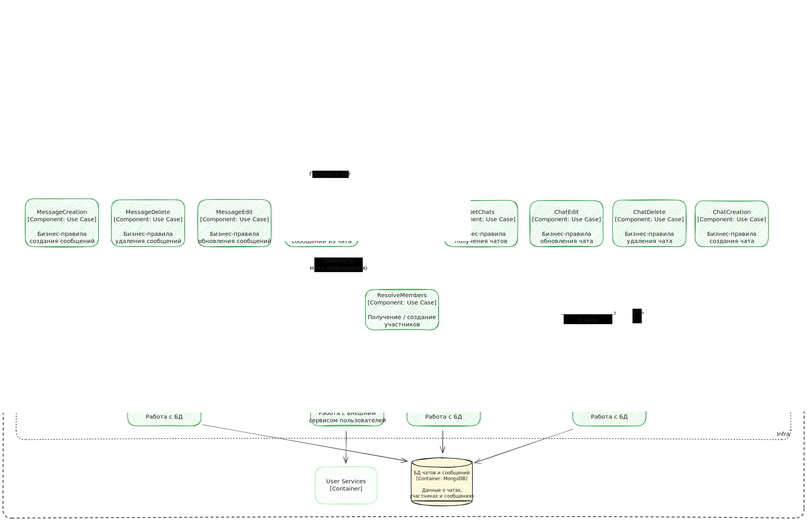

# Оглавление

- [Бизнес контекст](#бизнес-контекст)
- [Стейкхолдеры и их потребности](#стейкхолдеры-и-их-потребности)
- [Пользовательские истории](#пользовательские-истории)
- [Атрибуты качества и не функциональные требования](#атрибуты-качества-и-не-функциональные-требования)
- [Описание архитектуры в C4](#c4)

# Бизнес контекст

Компания хочет создать свою социальную сеть, чтобы монетизировать ее через рекламу, подписки, игры и внутренние микротранзакции. Целевая
аудитория — молодые люди до 40 лет, имеющие мобильные устройства.

## Бизнес цели

- **MAU** 1 млн. пользователей в первые пол года
- **DAU** 300 тысяч пользователей в первые пол года
- **Пятикратный рост MAU и DAU** каждый год в течении трех лет

## Бизнес драйверы

- **Запуск** до окончания курса HighLoad
- **Привлечение и удержание целевой аудитории** за счет возможности общаться в личных и групповых чатах, делиться контентом,
  обсуждать общие темы в сообществах и постах, находить друзей, подписываться на медиа-персов, персонализировать свой профиль
- **Привлечение медиа-персов** для привлечения их аудитории за счет возможностей вести свою официальную страницу и публиковать контент
- **Привлечение малого и среднего бизнеса** за счет аудитории, инструментов аналитики, рекламы и продажи товаров
- **Простота регистрации** для любого пользователя, где требуется только Имя, логин и пароль

# Стейкхолдеры и их потребности

## Пользователь (на основе ДЗ)

- Простая регистрация через WEB, мобильное устройство
- Поиск и добавление друзей по фамилии и имени
- Публикация постов для своих друзей
- Чтение постов своих друзей
- Личные сообщения

## Медиа-персона (гипотетические)

- Создание сообщества вокруг своей персоны
- Подтверждение прав на сообщество
- Управление сообществом, делегирование прав на управление
- Публикация контента в сообществе

## Предприниматель (гипотетические)

- Создание сообщества вокруг своего бизнеса
- Витрина товаров с описанием, медиа-контентом, секцией вопросов и ответов
- Управление сообществом, делегирование прав на управление
- Рекламирование продукции пользователям
- Аналитические отчеты по рекламе

# Пользовательские истории

## Пользователь (на основе ДЗ)

- Как пользователь, я хочу регистрироваться через удобную веб-форму, чтобы быстро найти своих друзей
- Как пользователь, я хочу находить друзей по фамилии и имени, чтобы добавить их в список друзей и начать с ними общаться
- Как пользователь, я хочу добавлять других пользователей в список друзей, чтобы быстро их находить
- Как пользователь, я хочу публиковать посты от своего имени, чтобы делиться информацией с друзьями
- Как пользователь, я хочу видеть опубликованные посты всех моих друзей
- Как пользователя, я хочу вести переписку в личных сообщениях со своими друзьями

# Атрибуты качества и не функциональные требования

## Надежность

- SLA: 99,99% (52м 36с / год)
- RPO (целевая точка восстановления): 30 минут
- RTO (целевое время восстановления): 1 час
- Покрыты unit / интеграционными тестами 90% кода связанного с:
    - регистрацией и входом
    - поиском пользователей
    - публикацией и отображением постов
    - личными сообщениями

## Безопасность и аудит

- Пароли пользователей зашифрованы
- Доступ к серверам приложения и БД имеют пользователи со специальными правами

## Масштабируемость

- p99 регистрации < 300мс
- p99 поиска пользователей < 100мс
- p99 формирования ленты публикаций друзей < 100мс
- p99 отправки сообщения в чат < 50мс
- p99 чтения сообщений из чатов < 100мс

# C4

## Контекстная диаграмма

## Диаграмма контейнеров

## Диаграммы компонентов

### Сервис Пользователей

TBD

### Сервис Постов

### Сервис Чатов

