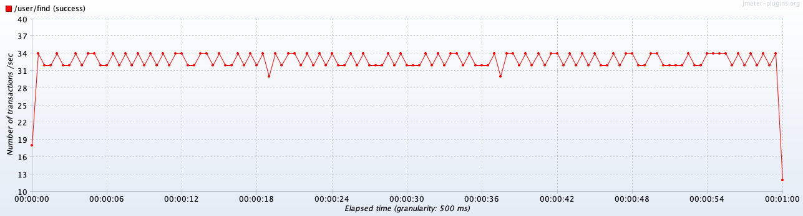

# Нагрузочное тестирование с JMeter

## Оглавление

- [Подготовка](#подготовка)
- [Нагрузочное тестирование](#нагрузочное-тестирование)
- [Результаты тестирования без индексов на БД](#результаты-тестирования-без-индексов-на-бд)
- [Результаты тестирования с индексами на БД](#результаты-тестирования-с-индексами-на-бд)
- [Почему именно GIN-индекс?](#почему-именно-gin-индекс)

## Подготовка

Установите [JMeter](https://jmeter.apache.org) на свой компьютер по инструкциям из интернета.

Установите [JMeter Plugins Manager](https://jmeter-plugins.org/wiki/PluginsManager/) и через него установите расширения:

- 3 Basic Graphs
- 5 Additional Graphs

Запустите JMeter и откройте файл проекта [hw02.jmx](/test/jmeter/hw02.jmx).

Запустите приложение по инструкции в файле [README.md](../user-service/README.md).

## Нагрузочное тестирование

Перед началом убедитесь, что у вас запущено база данных и приложение. База данных должна содержать ~1,000,000 записей с пользователями, как
это описано в [README.md](../user-service/README.md).

Тестирование будем проводить на API поиска пользователей, которое принимает параметры `firstName` и `lastName`. В файле проекта JMeter уже
настроен модуль HTTP Request, который генерирует случайные символы по формулам ниже:

```
firstName = ${__RandomString(1,АБВГДЕЖЗИКЛМНОПРСТУФ,)}${__RandomString(1,абвгдежзиклмнопрсту,)}
lastName  = ${__RandomString(1,АБВГДЕЖЗИКЛМНОПРСТУФ,)}
```

Это позволяет получить для имени пользователя две случайные буквы, а для фамилии одну.

Проект в JMeter настроен на безлимитную отправку запросов в течении 60 секунд. Для запуска теста воспользуйтесь специальной кнопкой, а для
изменения количества одновременных соединений (пользователей) перейдите в `Test Plan -> Find users` и измените параметр Number of Threads
(users).

## Результаты тестирования без индексов на БД

**Сводная таблица:**

| Users | Label      | # Samples | Average | Median | 90% Line | 95% Line | 99% Line | Min |   Max | Error % | Throughput | Received KB/sec | Sent KB/sec |
|:------|:-----------|----------:|--------:|-------:|---------:|---------:|---------:|----:|------:|--------:|-----------:|----------------:|------------:|
| 1     | /user/find |      1974 |      30 |     30 |       32 |       33 |       37 |  25 |    63 |  0.000% |   32.89781 |          651.13 |        8.80 |
| 10    | /user/find |      2325 |     256 |    299 |      349 |      358 |      372 |  35 |   412 |  0.000% |   38.67716 |          751.30 |       10.35 |
| 100   | /user/find |      2399 |    2532 |   2598 |     2711 |     2729 |     2767 | 147 |  5068 |  0.000% |   38.41289 |          803.49 |       10.28 |
| 1000  | /user/find |      3267 |   22264 |  26379 |    26613 |    26664 |    26736 | 201 | 31737 |  0.000% |   37.79806 |          700.51 |       10.11 |

**Latency / Throughput для 1 пользователя:**




**Latency / Throughput для 10 пользователей:**


**Latency / Throughput для 100 пользователей:**


**Latency / Throughput для 1000 пользователей:**


## Результаты тестирования с индексами на БД

**Сводная таблица:**

| Users | Label      | # Samples | Average | Median | 90% Line | 95% Line | 99% Line | Min | Max | Error % | Throughput | Received KB/sec | Sent KB/sec |
|:------|:-----------|----------:|--------:|-------:|---------:|---------:|---------:|----:|----:|--------:|-----------:|----------------:|------------:|
| 1     | /user/find |     51954 |       1 |      1 |        2 |        3 |       10 |   0 |  49 |  0.000% |  865.90000 |        17008.12 |      231.70 |
| 10    | /user/find |    314277 |       1 |      1 |        4 |        6 |       15 |   0 |  97 |  0.000% | 5236.37909 |       105495.96 |     1401.14 |
| 100   | /user/find |    341683 |      17 |     16 |       30 |       36 |       53 |   0 | 230 |  0.000% | 5691.58629 |       115344.78 |     1522.94 |
| 1000  | /user/find |    333839 |     178 |    179 |      215 |      230 |      264 |   0 | 487 |  0.000% | 5535.75100 |       110877.99 |     1481.25 |

**Latency / Throughput для 1 пользователя:**


**Latency / Throughput для 10 пользователей:**


**Latency / Throughput для 100 пользователей:**


**Latency / Throughput для 1000 пользователей:**


## Индексы для БД

Результаты нагрузочно тестирования с индексами говорят сами за себя — latency сократилась в 100 раз, а throughput вырос в 140 раз!

Такие результаты были получены только за счет добавления GIN-индексов для колонок first_name и last_name:

```sql
CREATE EXTENSION pg_trgm;
CREATE INDEX idx_users_first_last_name_gin ON users USING gin (first_name gin_trgm_ops, last_name gin_trgm_ops);
```

Размер такого индекса ~12% от размера таблицы:

```sql
SELECT pg_size_pretty(pg_total_relation_size('users'));
-- 249 MB

SELECT pg_size_pretty(pg_total_relation_size('idx_users_first_last_name_gin'));
-- 28 MB
```

Сравним вывод планировщика без индексов:

```sql
EXPLAIN ANALYZE
select first_name from users WHERE first_name LIKE 'Ан%' AND last_name LIKE 'А%';
```
```
Gather  (cost=1000.00..27176.47 rows=3309 width=13) (actual time=0.719..59.247 rows=3773 loops=1)
   Workers Planned: 2
   Workers Launched: 2
   ->  Parallel Seq Scan on users  (cost=0.00..25845.57 rows=1379 width=13) (actual time=0.026..49.070 rows=1258 loops=3)
         Filter: (((first_name)::text ~~ 'Ан%'::text) AND ((last_name)::text ~~ 'А%'::text))
         Rows Removed by Filter: 332053
 Planning Time: 1.187 ms
 Execution Time: 59.544 ms
(8 rows)
```

И с индексами:

```
 Bitmap Heap Scan on users  (cost=33.38..3319.77 rows=3309 width=13) (actual time=3.168..8.508 rows=3773 loops=1)
   Recheck Cond: (((first_name)::text ~~ 'Ан%'::text) AND ((last_name)::text ~~ 'А%'::text))
   Heap Blocks: exact=981
   ->  Bitmap Index Scan on idx_users_first_last_name_gin  (cost=0.00..32.55 rows=3309 width=0) (actual time=2.882..2.883 rows=3773 loops=1)
         Index Cond: (((first_name)::text ~~ 'Ан%'::text) AND ((last_name)::text ~~ 'А%'::text))
 Planning Time: 0.325 ms
 Execution Time: 8.942 ms
```

## Почему именно GIN-индекс?

В вышеуказанном запросе на создание индекса вы могли заметить расширение `pg_trgm`, которое разбивает строки на триграммы - 
последовательности из 3 символов. Например:

```
Для строки "Andrey" триграммы:
"And", "ndr", "dre", "rey"
Для "Abdulov":
"Abd", "bdu", "dul", "ulo", "lov"
```

После этого GIN (Generalized Inverted Index), или обратный индекс, работает как словарь в конце книги:

- Ключ: триграмма (например, "And")
- Значение: список строк БД, содержащих эту триграмму

Используя их вместе мы получаем мощную систему для нечеткого поиска.