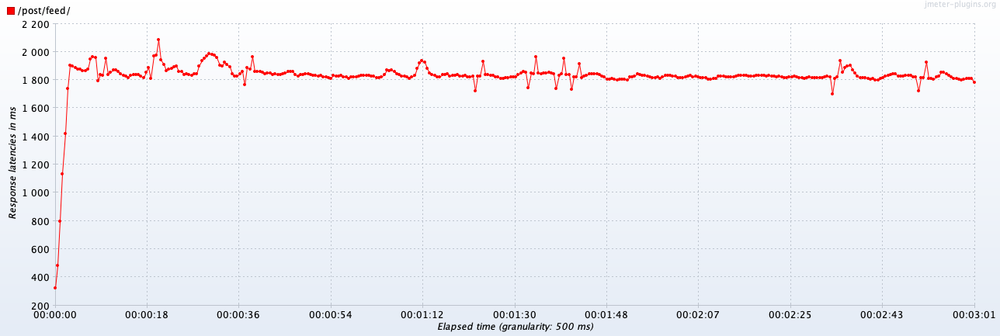
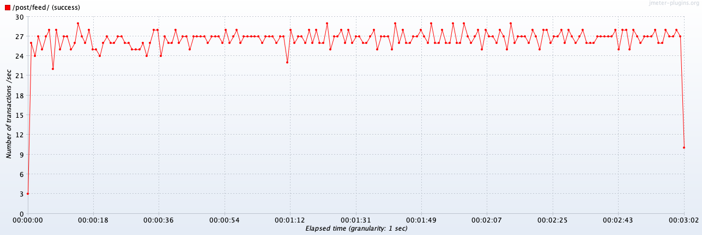

# Лента постов от друзей

## Оглавление

- [Подготовка](#Подготовка)
    - [Изменение структуры проекта](#изменение-структуры-проекта)
    - [Переход на UUIDv7](#переход-на-uuidv7)
- [Реализовать API (синхронный rest)](#реализовать-api-синхронный-rest)
- [Структура БД для хранения постов пользователей](#структура-бд-для-хранения-постов-пользователей)
    - [Наполнение данных в user-service](#наполнение-данных-в-user-service)
    - [Наполнение данных в post-service](#наполнение-данных-в-post-service)
- [Нагрузочное тестирование без кэширования](#нагрузочное-тестирование-без-кэширования)
- [Добавление кэширования](#добавление-кэширования)
- 

## Подготовка

### Изменение структуры проекта

Функциональность ленты постов отлично подходит для практики по микросервисной архитектуре, поэтому я выделил функциональность работы с
пользователем (регистрация, поиск, списки друзей) в сервис **user-service**, а создание постов и ленту постов друзей в сервис
**post-service**.

Это накладывает определенную специфику в реализации, которыми я пока пренебрег:

В промышленной среде для обнаружения и взаимодействия между микросервисами используется специальной софт, например Consul. В моем же
случае они поднимаются на разных портах: `user-service:8080`, `post-service:8081`.

Коммуникация между сервисами может происходить через REST API (простой вариант) или брокеры сообщений (более трудоемкий). В варианте с
REST API, на котором я остановился, желательно использовать аутентификацию между сервисами, чтобы:

&nbsp;&nbsp;&nbsp;&nbsp;а) не делать публичное API\
&nbsp;&nbsp;&nbsp;&nbsp;б) контролировать доступ одного микросервиса к другому

Чтобы не реализовывать аутентификацию в каждом сервисе для решения этой задачи всё так же используется софт по типу Consul. А в моем случае
просто реализовано публичное API в `user-service`.

### Переход на UUIDv7

В микросервисной архитектуре использование SERIAL ID — является антипаттерном. Поэтому, в первую очередь, я решил перевести сервис
**user-service** на UUIDv7.

#### Почему UUIDv7?

**\+** он поддерживает последовательную сортировку, дефакто новый стандарт\
**\+** будет нативно поддерживаться в PostgreSQL 18\
**\+** легок и просто в обращении

**\-** занимает 128 бит, в отличии от более сложных решений (Twitter Snowflake, Sonyflake), что особенно важно в высоконагруженных системах

#### Как установить

Есть минимум три варианта, как получить функции генерации UUIDv7 на своем PostgreSQL <=17:

1. Использовать расширение [pg_uuidv7](https://github.com/fboulnois/pg_uuidv7)
2. Использование расширения `uuid-ossp` с кастомной функцией
3. Написать свою или найти примеры функций для PostgreSQL

Я пошел по первому пути, так как хотел использовать унифицированное переносимое решение. По ссылке выше описан процесс установки и
компиляции из исходников. После чего остается только выполнить на `pg-master` команду:

```sql
CREATE EXTENSION pg_uuidv7;
```

И можно использовать функцию:

```sql
SELECT uuid_generate_v7();
-- 019971bf-a13b-7fae-81e2-9880257bfba4
```

#### Миграция со старого ID

Создаем новую колонку и удаляем старую:

```sql
START TRANSACTION;

ALTER TABLE users
    RENAME COLUMN user_id TO user_id_old;
ALTER TABLE users
    ADD COLUMN user_id uuid DEFAULT uuid_generate_v7();
ALTER TABLE users
    DROP CONSTRAINT users_pkey,
    ADD PRIMARY KEY (user_id);
ALTER TABLE users
    DROP COLUMN user_id_old;

COMMIT;

```

Создаем индексы для новой колонки и выполняем вакуум:

```sql
CREATE UNIQUE INDEX CONCURRENTLY users_uuid_idx ON users (user_id);
VACUUM ANALYZE users;

```

Пример результата:

```
select * from users limit 1;

-[ RECORD 1 ]------------------------------------------------------------
first_name | Ева
last_name  | Абрамова
birth_date | 2010-01-01
gender     | 
interests  | 
city_id    | 197
username   | abramovae3261
password   | $2a$04$OGuod6JuDmEsUdK/MgN4AOpGkn0jjKVLdQE4DLhC1y9FnT6YQFbmi
user_id    | 01997291-1f62-72f5-b07b-92aefafd6b16
```

## Реализовать API (синхронный rest)

В сервисе `user-service` (в классе
[UserFriendsheepController.java](../user-service/src/main/java/ru/webdl/otus/socialnetwork/infra/user/rest/UserFriendsheepController.java))
реализованы методы:

- `/api/v1/user/friend/all` — список друзей текущего пользователя
- `/api/v1/user/friend/get/{userId}` — список друзей указанного пользователя
- `/api/v1/user/friend/add/{userId}` — добавить друга
- `/api/v1/user/friend/delete/{userId}` — удалить друга

В сервисе `post-service` (в классе
[PostController.java](../post-service/src/main/java/ru/webdl/otus/socialnetwork/infra/post/PostController.java)) реализованы методы:

- `/api/v1/post/create` — создание нового поста
- `/api/v1/post/get/{postId}` — получение единичного поста
- `/api/v1/post/feed/{userId}` — получение ленты постов друзей указанного пользователя

## Структура БД для хранения постов пользователей

Посты хранятся в простой таблице:

```sql
CREATE TABLE posts
(
    post_id UUID PRIMARY KEY     DEFAULT uuid_generate_v7(),
    user_id UUID        NOT NULL,
    content TEXT        NOT NULL,
    created TIMESTAMPTZ NOT NULL DEFAULT CURRENT_TIMESTAMP,

    CONSTRAINT fk_user FOREIGN KEY (user_id) REFERENCES authors (user_id) ON DELETE CASCADE
);
```

Всю схему можно посмотреть в файле [schema.sql](../post-service/src/main/resources/schema.sql).

### Наполнение данных в user-service

Создаем 5 случайных пользователей прямо в БД (в качестве пароля используется слово `password`):

```sql
INSERT INTO users(first_name, last_name, username, password)
VALUES ('Елена', 'Иванова', 'elena.ivanova', '$2a$04$qACvewkSSZ3b6Z5m6mHx.uGjB1Y/blzT6FJX/HoiQsRLRVxpowMOK'),
       ('Алексей', 'Петров', 'aleksey.petrov', '$2a$04$qACvewkSSZ3b6Z5m6mHx.uGjB1Y/blzT6FJX/HoiQsRLRVxpowMOK'),
       ('Мария', 'Сидорова', 'maria.sidorova', '$2a$04$qACvewkSSZ3b6Z5m6mHx.uGjB1Y/blzT6FJX/HoiQsRLRVxpowMOK'),
       ('Дмитрий', 'Козлов', 'dmitry.kozlov', '$2a$04$qACvewkSSZ3b6Z5m6mHx.uGjB1Y/blzT6FJX/HoiQsRLRVxpowMOK'),
       ('Анна', 'Смирнова', 'anna.smirnova', '$2a$04$qACvewkSSZ3b6Z5m6mHx.uGjB1Y/blzT6FJX/HoiQsRLRVxpowMOK');
```

Добавим всех пользователей в друзья `admin`:

```sql
INSERT INTO user_friends(user_id, friend_id)
SELECT u1.user_id, u2.user_id
FROM users u1
         CROSS JOIN users u2
WHERE (u1.username = 'admin' AND u2.username IN ('elena.ivanova', 'aleksey.petrov', 'maria.sidorova', 'dmitry.kozlov', 'anna.smirnova'))
   OR (u2.username = 'admin' AND u1.username IN ('elena.ivanova', 'aleksey.petrov', 'maria.sidorova', 'dmitry.kozlov', 'anna.smirnova'));
```

### Наполнение данных в post-service

В `user-service` получаем данные:

```sql
SELECT user_id, first_name || ' ' || last_name AS display_name
FROM users
WHERE username IN ('elena.ivanova', 'aleksey.petrov', 'maria.sidorova', 'dmitry.kozlov', 'anna.smirnova');

```

В `post-service` создаем записи об авторах:

```sql
INSERT INTO authors(user_id, display_name)
VALUES ('019994a8-4c6b-7db4-9993-be35230e9e76', 'Елена Иванова'),
       ('019994a8-4c6b-7e6a-92aa-4db3ae6f22a1', 'Алексей Петров'),
       ('019994a8-4c6b-7d2d-9c79-faea7d4e9ab0', 'Мария Сидорова'),
       ('019994a8-4c6b-7f14-8840-6c10c354955d', 'Дмитрий Козлов'),
       ('019994a8-4c6b-7206-ab7b-83c6cb97748a', 'Анна Смирнова');

```

И генерируем посты 1,000,000 постов случайным образом:

```sql
SELECT generate_random_posts_batch(ARRAY [
    '019994a8-4c6b-7db4-9993-be35230e9e76'::UUID,
    '019994a8-4c6b-7e6a-92aa-4db3ae6f22a1'::UUID,
    '019994a8-4c6b-7d2d-9c79-faea7d4e9ab0'::UUID,
    '019994a8-4c6b-7f14-8840-6c10c354955d'::UUID,
    '019994a8-4c6b-7206-ab7b-83c6cb97748a'::UUID
    ]);

```

Подробнее посмотреть на функции генерации можно в файле [schema-dev.sql](../post-service/src/main/resources/schema-dev.sql)

Дополнительные варианты использования:

```sql
SELECT generate_random_posts_batch(
               p_user_uuids := ARRAY [
                   '019994a8-4c6b-7db4-9993-be35230e9e76'::UUID,
                   '019994a8-4c6b-7e6a-92aa-4db3ae6f22a1'::UUID
                   ],
               p_total_records := 50000,
               p_batch_size := 500
       );

```

## Нагрузочное тестирование без кэширования

Традиционно, чтобы сравнить результаты до и после добавления кэширования, произведем замеры latency и throughput на наше REST API. Ранее
мы добавили 5 друзей к УЗ администратора системы и опубликовали от их имени порядка 1 млн. постов. Правда, за счет принятого ограничения,
мы будем показывать не более 1,000 постов.

Нагрузку производили в 50 потоков на адрес вида `/api/v1/post/feed/{userId}`, где в конце указан UUID УЗ админа. Профиль для JMeter
[hw04.jmx](../post-service/src/test/jmeter/hw04.jmx).

Стоит обратить внимание, что из-за объема скачиваемых данных по API (~13Мб) JMeter может упасть с OOM. Поэтому рекомендую запускать его с
параметрами:

```
export HEAP="-Xms1g -Xmx4g"
export NEW="-XX:NewSize=256m -XX:MaxNewSize=512m"
export PERM="-XX:PermSize=64m -XX:MaxPermSize=128m"
```

**Результаты прогона:**

| Label       | # Samples | Average | Median | 90% Line | 95% Line | 99% Line | Min | Max  | Error % | Throughput | Received KB/sec | Sent KB/sec |
|-------------|-----------|---------|--------|----------|----------|----------|-----|------|---------|------------|-----------------|-------------|
| /post/feed/ | 4312      | 2093    | 2097   | 2249     | 2323     | 2423     | 335 | 3948 | 0.000%  | 23.69218   | 329466.06       | 5.62        |

**Latency:**



**Throughput:**



## Добавление кэширования

Нарушая главное правило микросервисной архитектуры, которое гласит "микросеврис должен быть stateless", мы не будем поднимать новый сервис
Redis для кэширования, а обойдемся [встроенным в Spring Boot кэшом](https://docs.spring.io/spring-boot/reference/io/caching.html).

Для этого в pom.xml добавляются зависимости:

```xml
<dependency>
    <groupId>org.springframework.boot</groupId>
    <artifactId>spring-boot-starter-cache</artifactId>
</dependency>
<dependency>
    <groupId>com.github.ben-manes.caffeine</groupId>
    <artifactId>caffeine</artifactId>
</dependency>
```

Добавляется конфигурация: [CacheConfig.java](../post-service/src/main/java/ru/webdl/otus/socialnetwork/CacheConfig.java)

А на кэшируемое API вешается аннотация (в файле 
[PostController.java](../post-service/src/main/java/ru/webdl/otus/socialnetwork/infra/post/PostController.java)):

```java
@Cacheable(value = "userFeed", key = "#userId", unless = "#result == null || #result.body.isEmpty()")
public ResponseEntity<List<PostResponse>> getFeed(@PathVariable UUID userId);
```

Таким образом мы за несколько минут можем быстро поднять локальный кэш и ощутить всю его мощь! (Но помним, что это делает из нашего сервиса 
statefull сервис...). Давайте посмотрим, к чему это приведет с точки зрения нагрузочного тестирования.
