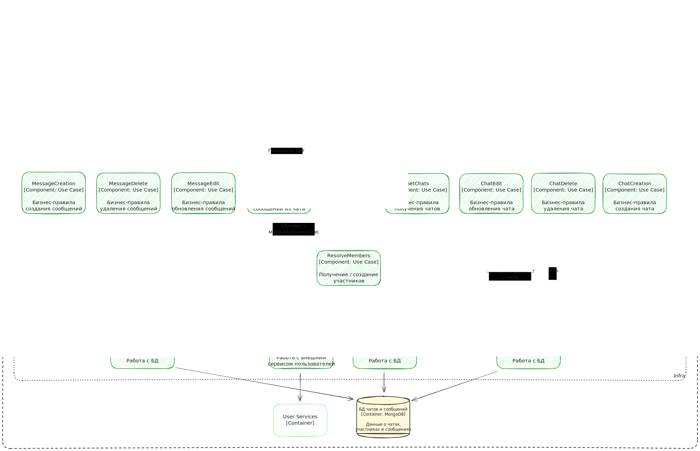

# Масштабируемая подсистема диалогов

## Оглавление

- [Подготовка](#подготовка)
  - [азработка архитектуры сервиса диалогов](#разработка-архитектуры-сервиса-диалогов)
  - [Переосмысление авторизации](#переосмысление-авторизации)
- [Будущие улучшения](#будущие-улучшения)
- [Реализация сервиса диалогов](#реализация-сервиса-диалогов)

## Подготовка

### Разработка архитектуры сервиса диалогов

С целью систематизации разрабатываемых сервисов было принято решение сделать шаг назад и проработать архитектуру всего продукта.
Всё началось с выделения бизнес-контекста, целей, стейкхолдеров и составления первичных бизнес-требований. Подробнее про это вы можете
почитать в разделе документации [arch](../doc/arch). Этот документ ложится в основу как ранее созданных сервисов, так и нового сервиса
диалогов.

Вторым этапом я описал по модели C4 первые 3 уровня всех микросервисов (за исключением user-service). Это позволило спроектировать 
взаимодействие компонентов сервиса, а дальше оставалось дело техники — написание самого кода.

Схема для сервиса диалогов выглядит следующим образом:

Данная схема достаточно подробно описывает связи компонентов, но всё еще скрывает детали реализации, описываемые на 4-м уровне модели C4,
что мне и требовалось. Так, например, если сравнивать ее с кодом [chat-service](../chat-service), вы непременно найдете компонены с 
одинаковыми именами и связи между ними будут выстроены согласно схеме. Но это будет лишь часть классов, которые потребовались для 
создания сервиса диалогов. 

### Переосмысление авторизации

В предыдущих версиях продукта я делал публичное REST API, в которое можно обращаться без авторизации. Предполагалось, что сервис
аутентификации будет пропускать только авторизованные запросы к таким сервисам. Этот подход претерпел важное изменение: вместо публичного
API, или необходимости передавать в каждом теле запроса идентификатор пользователя, я поместил его в заголовки запроса (headers). Таким
образом задача сервиса аутентификации "обоготить" запрос от пользователя дополнительными заголовками и направить его дальше.

С точки зрения кода такой подход прост и лаконичен, ведь разработчику достаточно использовать аннотацию чтения заголовком чтобы
гарантировать авторизованный доступ к своему сервису.

## Будущие улучшения

На проектирование и реализацию сервиса ушло немало времени. Была проделана большая работа по изучению материалов по построению системы
диалогов с точки зрения архитектуры и реализации, поэтому не всё задуманное удалось реализовать. Список ниже содержит перечень улучшений
функциональности, надежности и производительности, которые не влияют на домашнее задание, но могли бы быть сделаны в будущем:

1. Мониторинг MongoDB в Grafana
2. Механизм применеия схемы данных из кода в MongoDB
3. Мета-информация для каждого пользователя по их чатам (непрочитанные сообщения и т.п.)
4. Кэширование: сообщений в чатах, мета-информации о чатах
5. Пагинация сообщений в чатах
6. Групповые чаты
7. Улучшенный механизм борьбы с эффектом Леди Гага, включая пагинацию и сортировку сообщений

## Реализация сервиса диалогов

