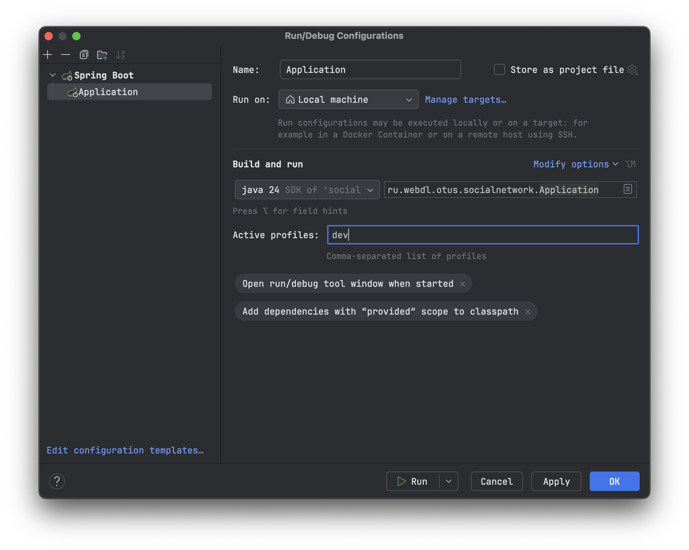

# Инициализация

Подключитесь к своему серверу БД PostgreSQL, создайте УЗ и БД:

```sql
CREATE ROLE socialnet WITH
    LOGIN
    PASSWORD 'socialnet';

CREATE DATABASE socialnet
    WITH
    OWNER = socialnet
    ENCODING = 'UTF8';
```

Перейдите в файл [application-dev.properties](src/main/resources/application-dev.properties) и задайте параметр `spring.datasource.url`.

Перейдите в файл [Application.java](src/main/java/ru/webdl/otus/socialnetwork/Application.java) и создайте новую конфигурацию запуска, как
показано ниже:

Запустите приложение через созданную конфигурацию и REST API будет доступен по адресу http://localhost:8080/user/.

# Загрузка тестовых данных в БД

**Обратите внимание!**

После первого запуска приложения в каталоге `target/` автоматически скачается файл `people.v2.csv` из репозитория
https://github.com/OtusTeam/highload/tree/master/homework. Данный файл имеет ошибку, поэтому перед его использованием обязательно откройте
его любым редактором и удалите последнюю строчку! После этого переходите к шагам ниже.

Запустите psql, подключитесь к БД `socialnet`, и выполните (заменив путь до файла `target/people.v2.csv`):

```sql
\COPY tmp_users(full_name, birth_date, city_name) FROM '~/git/otus/otus-highload-2025-06-timofeevka/socialnetwork/target/people.v2.csv' WITH (FORMAT csv, DELIMITER ',', HEADER false);
```

Далее выполнители запросы ниже:

```sql
DROP SEQUENCE IF EXISTS username_seq;
CREATE SEQUENCE username_seq START 1;

INSERT INTO users (first_name, last_name, birth_date, city_id, username, password)
SELECT split_part(full_name, ' ', 2)                                  AS first_name,
       split_part(full_name, ' ', 1)                                  AS last_name,
       birth_date,
       c.city_id,
       ru_to_en(
               lower(split_part(full_name, ' ', 1)
                   || left(split_part(full_name, ' ', 2), 1)
               ))
           || nextval('username_seq')::text                           AS username,
       '$2a$10$uF1yne0CC4rCSoH6XkiJPuWbUp3/Jm0L2quSORZRG7NTCZsrwBjia' as password -- пароль "password" для всех пользователей
FROM tmp_users t
         JOIN cities c ON c.name = t.city_name;

DROP SEQUENCE IF EXISTS username_seq;
DROP TABLE IF EXISTS tmp_users;

```

# Тестирование

1. [HW01: Тестирование REST API через Postman](hw/HW01.md)
1. [HW02: Нагрузочное тестирование с JMeter](hw/HW02.md)

