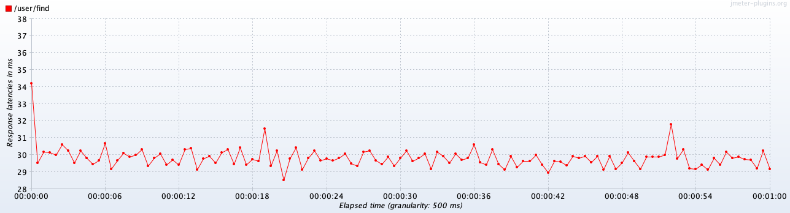
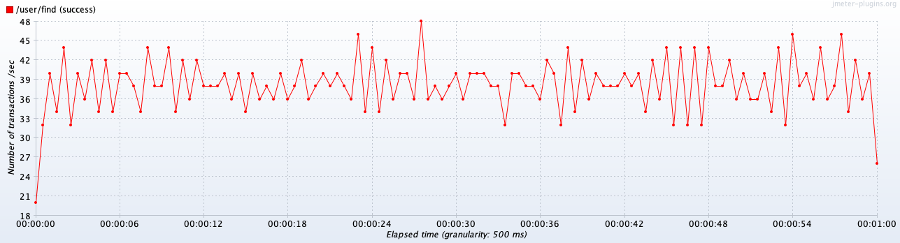
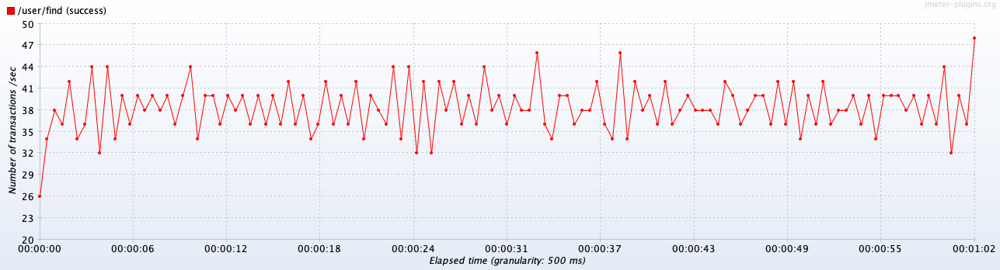

# Нагрузочное тестирование с JMeter

## Подготовка

Установите [JMeter](https://jmeter.apache.org) на свой компьютер по инструкциям из интернета.

Установите [JMeter Plugins Manager](https://jmeter-plugins.org/wiki/PluginsManager/) и через него установите расширения:

- 3 Basic Graphs
- 5 Additional Graphs

Запустите JMeter и откройте файл проекта [find-users.jmx](../src/test/jmeter/find-users.jmx).

Запустите приложение по инструкции в файле [README.md](../README.md).

## Нагрузочное тестирование

Перед началом убедитесь, что у вас запущено база данных и приложение. База данных должна содержать ~1,000,000 записей с пользователями, как
это описано в [README.md](../README.md).

Тестирование будем проводить на API поиска пользователей, которое принимает параметры `firstName` и `lastName`. В файле проекта JMeter уже
настроен модуль HTTP Request, который генерирует случайные символы по формулам ниже:

```
firstName = ${__RandomString(1,АБВГДЕЖЗИКЛМНОПРСТУФ,)}${__RandomString(1,абвгдежзиклмнопрсту,)}
lastName  = ${__RandomString(1,АБВГДЕЖЗИКЛМНОПРСТУФ,)}
```

Это позволяет получить для имени пользователя две случайные буквы, а для фамилии одну.

Проект в JMeter настроен на безлимитную отправку запросов в течении 60 секунд. Для запуска теста воспользуйтесь специальной кнопкой, а для
изменения количества одновременных соединений (пользователей) перейдите в `Test Plan -> Find users` и измените параметр Number of Threads
(users).

## Результаты тестирования без индексов на БД

**Сводная таблица:**

| Users | Label      | # Samples | Average | Median | 90% Line | 95% Line | 99% Line | Min |   Max | Error % | Throughput | Received KB/sec | Sent KB/sec |
|:------|:-----------|----------:|--------:|-------:|---------:|---------:|---------:|----:|------:|--------:|-----------:|----------------:|------------:|
| 1     | /user/find |      1974 |      30 |     30 |       32 |       33 |       37 |  25 |    63 |  0.000% |   32.89781 |          651.13 |        8.80 |
| 10    | /user/find |      2325 |     256 |    299 |      349 |      358 |      372 |  35 |   412 |  0.000% |   38.67716 |          751.30 |       10.35 |
| 100   | /user/find |      2399 |    2532 |   2598 |     2711 |     2729 |     2767 | 147 |  5068 |  0.000% |   38.41289 |          803.49 |       10.28 |
| 1000  | /user/find |      3267 |   22264 |  26379 |    26613 |    26664 |    26736 | 201 | 31737 |  0.000% |   37.79806 |          700.51 |       10.11 |

**Latency / Throughput для 1 пользователя:**




**Latency / Throughput для 10 пользователей:**




**Latency / Throughput для 100 пользователей:**




**Latency / Throughput для 1000 пользователей:**


## Результаты тестирования с индексами на БД

**Сводная таблица:**

| Users | Label      | # Samples | Average | Median | 90% Line | 95% Line | 99% Line | Min | Max | Error % | Throughput | Received KB/sec | Sent KB/sec |
|:------|:-----------|----------:|--------:|-------:|---------:|---------:|---------:|----:|----:|--------:|-----------:|----------------:|------------:|
| 1     | /user/find |     51954 |       1 |      1 |        2 |        3 |       10 |   0 |  49 |  0.000% |  865.90000 |        17008.12 |      231.70 |
| 10    | /user/find |    314277 |       1 |      1 |        4 |        6 |       15 |   0 |  97 |  0.000% | 5236.37909 |       105495.96 |     1401.14 |
| 100   | /user/find |    341683 |      17 |     16 |       30 |       36 |       53 |   0 | 230 |  0.000% | 5691.58629 |       115344.78 |     1522.94 |
| 1000  | /user/find |    333839 |     178 |    179 |      215 |      230 |      264 |   0 | 487 |  0.000% | 5535.75100 |       110877.99 |     1481.25 |

**Latency / Throughput для 1 пользователя:**


**Latency / Throughput для 10 пользователей:**


**Latency / Throughput для 100 пользователей:**


**Latency / Throughput для 1000 пользователей:**


