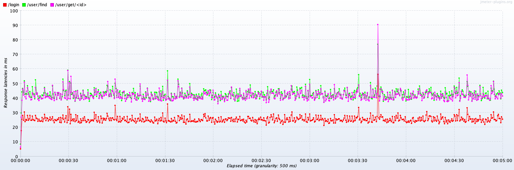
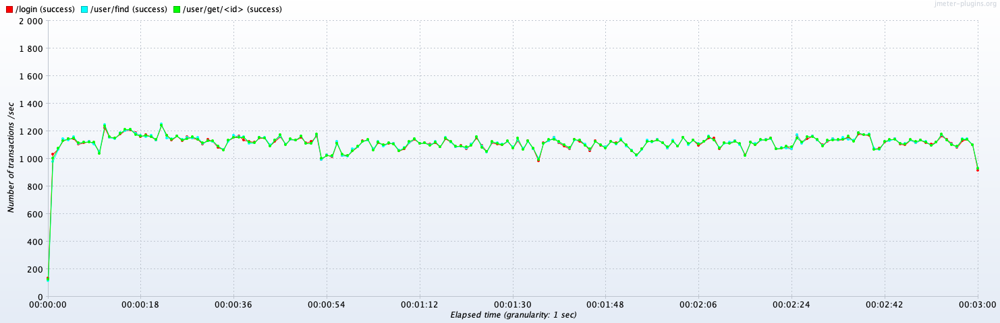
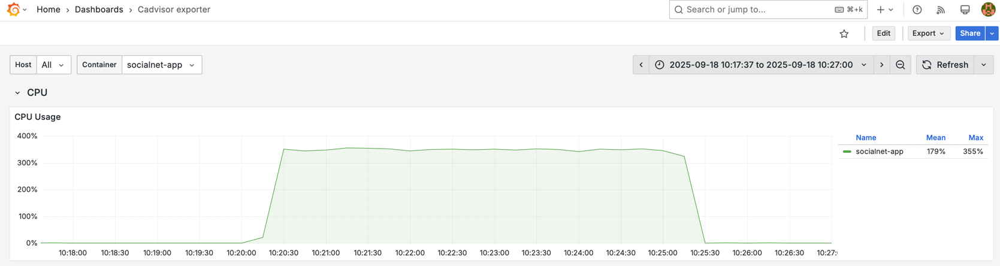
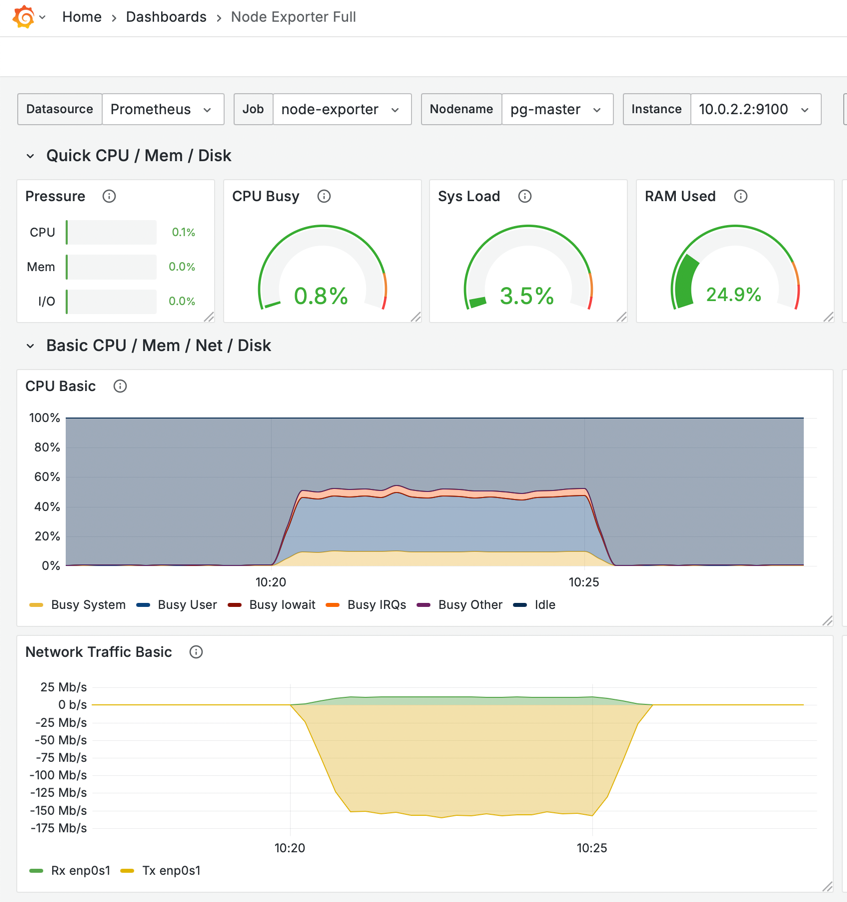

# Репликация и нагрузочное тестирование

## Оглавление

- [Подготовка](#подготовка)
    - [Перевод аутентификации на JWT](#перевод-аутентификации-на-jwt)
    - [Докеризация приложения и мониторинг](#докеризация-приложения-и-мониторинг)
- [Кластеризация PostgreSQL](#кластеризация-postgresql)
- [Нагрузочное тестирование. Этап №1](#нагрузочное-тестирование-этап-1)

## Подготовка

Для выполнения ДЗ была проведена предварительная подготовка окружения, которая позволяет снимать метрики. Вот из чего она состояла:

### Перевод аутентификации на JWT

Ранее в системе использовалась Basic Auth, из-за чего приходилось проходить авторизацию при каждом запросе. Это негативно влиялo на
показатели задержки и пропускной способности, так как, например, из примерно 100 мс на запрос данных о пользователе около 70 мс уходило
на проверку прав. Это удалось выявить с помощью
[MethodExecutionTimeLoggerAspect.java](../src/main/java/ru/webdl/otus/socialnetwork/MethodExecutionTimeLoggerAspect.java) и более детальных
измерений производительности на каждом этапе авторизации.

Поэтому решил перейти на JWT, чтобы после единой авторизации использовать легковесную аутентификацию по токену. Это значительно сократило
время обработки запросов — например, запрос данных о пользователе с уже полученным токеном занимает около 10 мс.

Однако нагрузочное тестирование не использует заранее подготовленный токен, а получает его в процессе, поэтому пришлось оптимизировать и
этап авторизации. При комплексном тестировании (авторизация + другие API) выяснилось, что получение токена занимает около 100 мс, что
негативно влияет на показатели задержки и пропускной способности для последующих вызовов.

Для решения этой проблемы в файле
[PasswordEncoderConfiguration.java](../src/main/java/ru/webdl/otus/socialnetwork/infra/conf/PasswordEncoderConfiguration.java) была
добавлена настройка, которая в dev-окружении использует минимальную сложность шифрования. После этого авторизация через API стала
занимать около 15 мс — что уже приемлемо по сравнению с другими запросами API.

### Докеризация приложения и мониторинг

Следующий шаг к упрощению локального развертывания не только приложения, но и сопутствующих систем. Так, в файле
[docker-compose.yml](../docker-compose.yml), вы увидите следующие системы:

- **app** — наша социальная сеть
- **prometheus** (+[конфигурация](../deploy/prometheus/config/prometheus.yml)) — для сбора метрик с остальных систем
- **grafana** (+[дашборды](../deploy/grafana/dashboards)) — для отображения графиков по метрикам
- **cadvisor** — для мониторинга docker-контейнеров
- **node-exporter** — для мониторинга операционной системы (ставится в т.ч. на сервера с БД)
- **postgres-exporter** — для мониторинга кластера PostgreSQL

Все приложения поднимаются автоматически с помощью docker-compose и взаимодействуют друг с другом.

## Кластеризация PostgreSQL

У меня уже было поднято несколько виртуальных машин с PostgreSQL 16, развертывание которых подробно описано в
[другой моей работе](https://github.com/webdl/otus-PostgreSQL-2025-05-timofeevka/tree/main/deploy/vm), поэтому я не стал докеризовать их.
И поэтому ниже описаны только шаги, с помощью которых я производил настройку кластеризации.

Итак, все есть 3 машины: `pg-master`, `pg-slave01`, `pg-slave02`.

На `pg-master` мы создает УЗ для репликации:

```sql
CREATE ROLE replica_user WITH
    LOGIN
    REPLICATION
    PASSWORD 'replica_user';
```

и настраиваем файл `pg_hba.conf`:

```yaml
{ type: host, database: replication, user: replica_user, address: '10.0.2.0/24', auth_method: md5 }
```

Это обязательное условие для физической репликации.

Далее на `pg-slave01` и `pg-slave02` выполняем одинаковые действия ниже. Для начала остановим кластер и изменим конфигурацию:

```shell
sudo su postgres
pg_ctlcluster 16 main stop
```

в файле `postgresql.conf`:

```
primary_conninfo='host=10.0.2.2 post=5432 user=replica_user password=replica_user'
```

далее удаляет или бекапим и переносим текущий каталог с данными:

```shell
rm -rf /mnt/pg_data/main/
```

и скачиваем данные с `pg-master` (требуется пароль от `replica_user`):

```shell
pg_basebackup -h 10.0.2.2 -D /mnt/pg_data/main/ -U replica_user -P --wal-method=stream -R
```

Запускаем кластер и через логи смотрим, что всё хорошо:

```shell
pg_ctlcluster 16 main start
```

Повторияем на второй ВМ.

Делаем простую проверку, например:

1. Подключитесь к `pg-master` с помощью PgAdmin4 и сделайте изменения в данных;
2. Подключитесь к `pg-slave01` и `pg-slave02` и проверьте, что данные изменились.

## Нагрузочное тестирование. Этап №1

Файл [HW03.md](HW03.md) содержит два профиля:

- **Get profile & Find users** — получает токен после авторизации, запрашивает пользователя с рандомным ID и ищет пользователей с 
рандомными ФИ.
- **Register users** — регистрирует пользователя с рандомными данными.

Выполняем пяти минутную нагрузку в 100 пользователей (потоков) и профилем **Get profile & Find users** и смотрим на полученные результаты:

### JMeter

| Label           | # Samples | Average | Median | 90% Line | 95% Line | 99% Line | Min | Max | Error % | Throughput | Received KB/sec | Sent KB/sec |
|-----------------|-----------|---------|--------|----------|----------|----------|-----|-----|---------|------------|-----------------|-------------|
| /login          | 270359    | 25      | 22     | 46       | 56       | 81       | 1   | 421 | 0.000%  | 901.04649  | 713.37          | 268.38      |
| /user/get/<id>  | 270328    | 41      | 39     | 72       | 85       | 116      | 1   | 474 | 0.000%  | 900.99422  | 526.41          | 354.48      |
| /user/find      | 270293    | 43      | 40     | 74       | 87       | 117      | 1   | 517 | 0.000%  | 900.89859  | 18390.38        | 383.59      |
| TOTAL           | 810980    | 36      | 33     | 67       | 80       | 110      | 1   | 517 | 0.000%  | 2702.81620 | 19628.66        | 1006.39     |

**Latency:**



**Throughput:**



### Grafana

**Приложение (docker):**



**БД (pg-master):**



