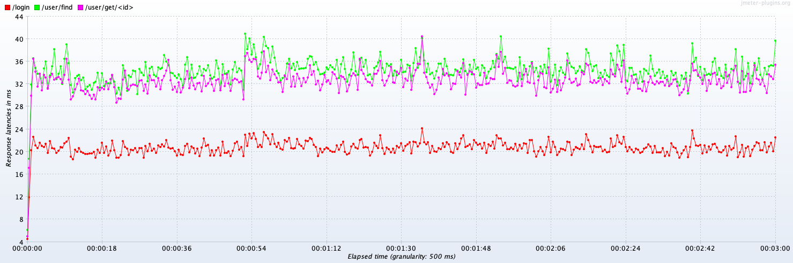
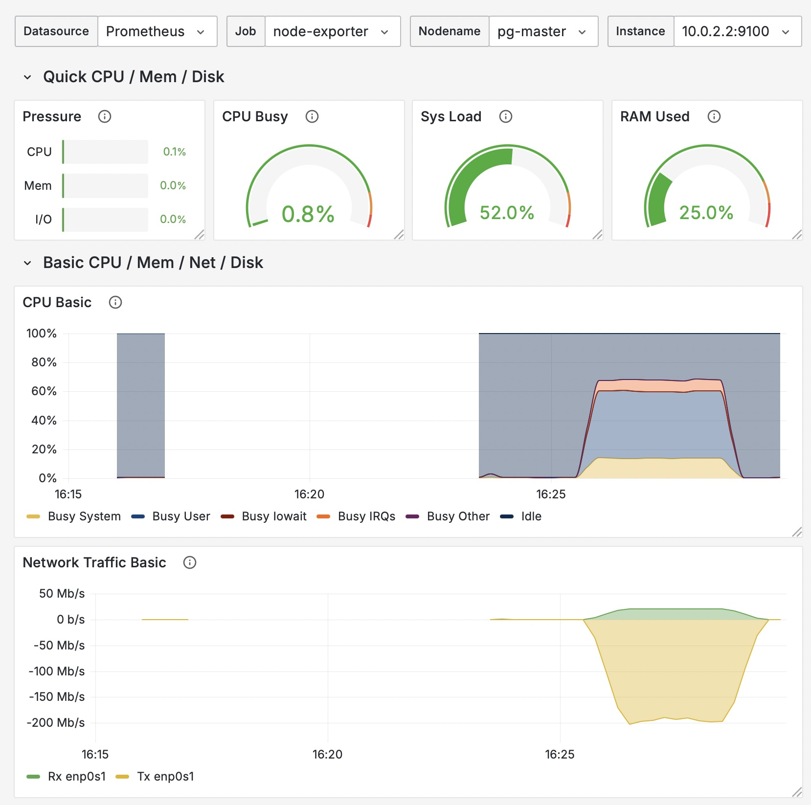
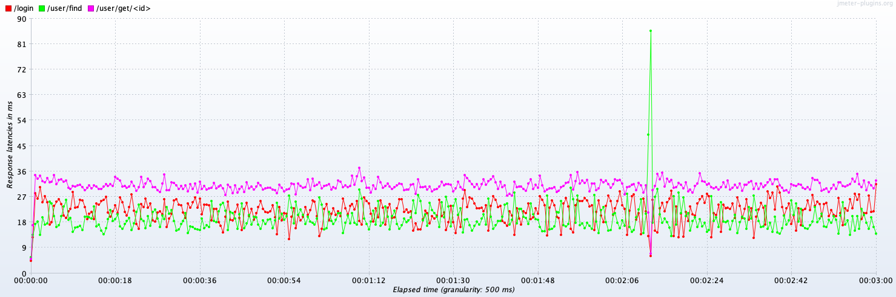
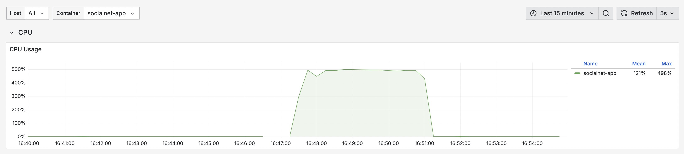
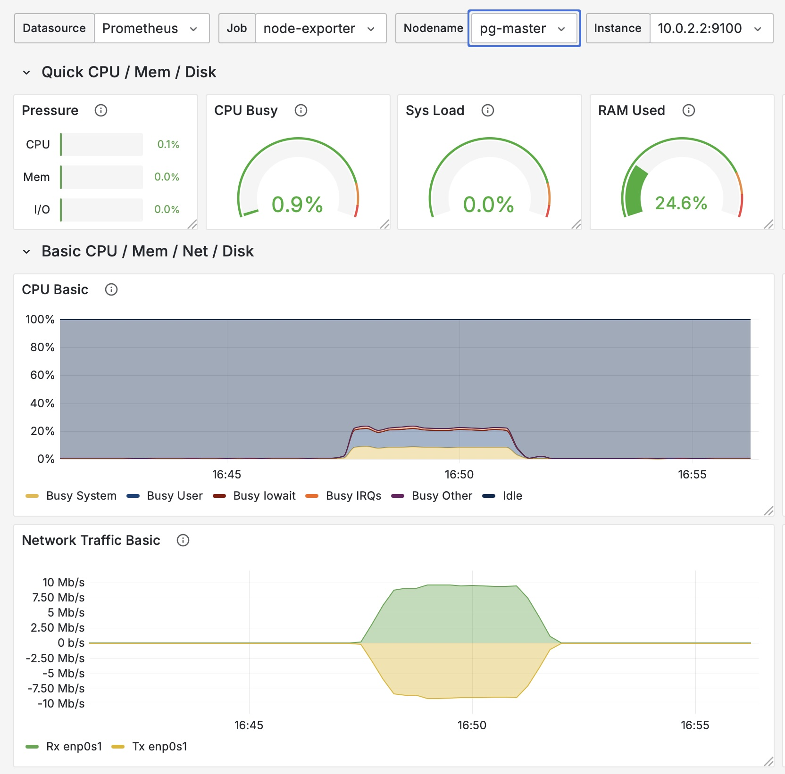
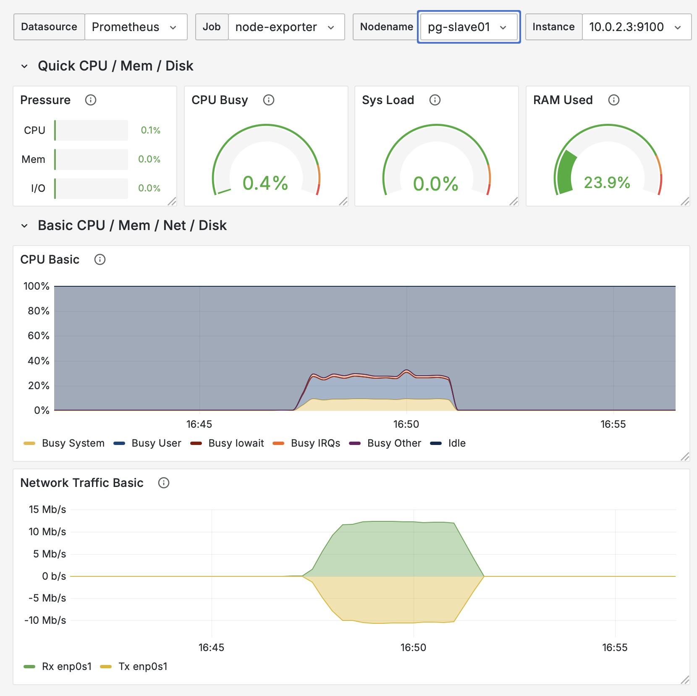

# Репликация и нагрузочное тестирование

## Оглавление

- [Подготовка](#подготовка)
    - [Перевод аутентификации на JWT](#перевод-аутентификации-на-jwt)
    - [Докеризация приложения и мониторинг](#докеризация-приложения-и-мониторинг)
    - [Кластеризация PostgreSQL](#кластеризация-postgresql)
- [Нагрузочное тестирование. Этап №1](#нагрузочное-тестирование-этап-1)
- [Добавление в проект Dynamic datasource](#добавление-в-проект-dynamic-datasource)
- [Нагрузочное тестирование. Этап №2](#нагрузочное-тестирование-этап-2)
- [Настройка синхронной репликации](#настройка-синхронной-репликации)
    - [Про синхронную репликацию](#про-синхронную-репликацию)
- [Нагрузочное тестирование. Этап №3](#нагрузочное-тестирование-этап-3)

## Подготовка

Для выполнения ДЗ была проведена предварительная подготовка окружения, которая позволяет снимать метрики. Вот из чего она состояла:

### Перевод аутентификации на JWT

Ранее в системе использовалась Basic Auth, из-за чего приходилось проходить авторизацию при каждом запросе. Это негативно влиялo на
показатели задержки и пропускной способности, так как, например, из примерно 100 мс на запрос данных о пользователе около 70 мс уходило
на проверку прав. Это удалось выявить с помощью
[MethodExecutionTimeLoggerAspect.java](../src/main/java/ru/webdl/otus/socialnetwork/MethodExecutionTimeLoggerAspect.java) и более детальных
измерений производительности на каждом этапе авторизации.

Поэтому решил перейти на JWT, чтобы после единой авторизации использовать легковесную аутентификацию по токену. Это значительно сократило
время обработки запросов — например, запрос данных о пользователе с уже полученным токеном занимает около 10 мс.

Однако нагрузочное тестирование не использует заранее подготовленный токен, а получает его в процессе, поэтому пришлось оптимизировать и
этап авторизации. При комплексном тестировании (авторизация + другие API) выяснилось, что получение токена занимает около 100 мс, что
негативно влияет на показатели задержки и пропускной способности для последующих вызовов.

Для решения этой проблемы в файле
[PasswordEncoderConfiguration.java](../src/main/java/ru/webdl/otus/socialnetwork/infra/conf/PasswordEncoderConfiguration.java) была
добавлена настройка, которая в dev-окружении использует минимальную сложность шифрования. После этого авторизация через API стала
занимать около 15 мс — что уже приемлемо по сравнению с другими запросами API.

### Докеризация приложения и мониторинг

Следующий шаг к упрощению локального развертывания не только приложения, но и сопутствующих систем. Так, в файле
[docker-compose.yml](../docker-compose.yml), вы увидите следующие системы:

- **app** — наша социальная сеть
- **prometheus** (+[конфигурация](../deploy/prometheus/config/prometheus.yml)) — для сбора метрик с остальных систем
- **grafana** (+[дашборды](../deploy/grafana/dashboards)) — для отображения графиков по метрикам
- **cadvisor** — для мониторинга docker-контейнеров
- **node-exporter** — для мониторинга операционной системы (ставится в т.ч. на сервера с БД)
- **postgres-exporter** — для мониторинга кластера PostgreSQL

Все приложения поднимаются автоматически с помощью docker-compose и взаимодействуют друг с другом.

### Кластеризация PostgreSQL

У меня уже было поднято несколько виртуальных машин с PostgreSQL 16, развертывание которых подробно описано в
[другой моей работе](https://github.com/webdl/otus-PostgreSQL-2025-05-timofeevka/tree/main/deploy/vm), поэтому я не стал докеризовать их.
И поэтому ниже описаны только шаги, с помощью которых я производил настройку кластеризации.

Итак, все есть 3 машины: `pg-master`, `pg-slave01`, `pg-slave02`.

На `pg-master` мы создает УЗ для репликации:

```sql
CREATE ROLE replica_user WITH
    LOGIN
    REPLICATION
    PASSWORD 'replica_user';
```

и настраиваем файл `pg_hba.conf`:

```yaml
{ type: host, database: replication, user: replica_user, address: '10.0.2.0/24', auth_method: md5 }
```

Это обязательное условие для физической репликации.

Далее на `pg-slave01` и `pg-slave02` выполняем одинаковые действия ниже. Для начала остановим кластер и изменим конфигурацию:

```shell
sudo su postgres
pg_ctlcluster 16 main stop
```

в файле `postgresql.conf`:

```
primary_conninfo='host=10.0.2.2 port=5432 user=replica_user password=replica_user application_name=slave01'
```

далее удаляет или бекапим и переносим текущий каталог с данными:

```shell
rm -rf /mnt/pg_data/main/
```

и скачиваем данные с `pg-master` (требуется пароль от `replica_user`):

```shell
pg_basebackup -h 10.0.2.2 -D /mnt/pg_data/main/ -U replica_user -P --wal-method=stream -R
```

Запускаем кластер и через логи смотрим, что всё хорошо:

```shell
pg_ctlcluster 16 main start
```

Повторияем на второй ВМ.

Делаем простую проверку, например:

1. Подключитесь к `pg-master` с помощью PgAdmin4 и сделайте изменения в данных;
2. Подключитесь к `pg-slave01` и `pg-slave02` и проверьте, что данные изменились.

## Нагрузочное тестирование. Этап №1

Файл [hw03.jmx](../src/test/jmeter/hw03.jmx) содержит два профиля:

- **Get profile & Find users** — получает токен после авторизации, запрашивает пользователя с рандомным ID и ищет пользователей с
  рандомными ФИ.
- **Register users** — регистрирует пользователя с рандомными данными.

Выполняем трех-минутную нагрузку в 100 пользователей (потоков) и профилем **Get profile & Find users** и смотрим на полученные результаты:

### JMeter

| Label          | # Samples | Average | Median | 90% Line | 95% Line | 99% Line | Min | Max | Error % | Throughput | Received KB/sec | Sent KB/sec |
|----------------|-----------|---------|--------|----------|----------|----------|-----|-----|---------|------------|-----------------|-------------|
| /login         | 201276    | 20      | 18     | 36       | 46       | 64       | 1   | 161 | 0.000%  | 1117.88948 | 885.04          | 332.97      |
| /user/get/<id> | 201254    | 32      | 31     | 57       | 67       | 90       | 1   | 198 | 0.000%  | 1117.76108 | 653.03          | 439.77      |
| /user/find     | 201216    | 34      | 33     | 60       | 70       | 93       | 1   | 207 | 0.000%  | 1117.48176 | 22696.80        | 475.80      |
| TOTAL          | 603746    | 29      | 25     | 53       | 64       | 86       | 1   | 207 | 0.000%  | 3352.65438 | 24232.35        | 1248.36     |

**Latency:**



**Throughput:**


### Grafana

**Приложение (docker):**


**БД (pg-master):**



## Добавление в проект Dynamic datasource

Для реализации Dynamic datasource добавляем зависимость:

```
...
<dependency>
    <groupId>com.baomidou</groupId>
    <artifactId>dynamic-datasource-spring-boot3-starter</artifactId>
    <version>4.3.1</version>
</dependency>
...
```

В классе [UserRepositoryImpl.java](../src/main/java/ru/webdl/otus/socialnetwork/infra/user/entities/UserRepositoryImpl.java) добавляем
аннотацию `@DS("slave_1")` на методы `findById` и `findByUsername`, а `@DS("slave_2")` на метод `findByFirstLastName`. Таким образом мы
распределим нагрузку на чтение на две ноды.

## Нагрузочное тестирование. Этап №2

Запускаем нагрузочное тестирование и смотрим результаты. Забегая вперед видим, что latency снизилось на ~10%, а throughput вырос на ~20%.

### JMeter

| Label          | # Samples | Average | Median | 90% Line | 95% Line | 99% Line | Min | Max | Error % | Throughput | Received KB/sec | Sent KB/sec |
|----------------|-----------|---------|--------|----------|----------|----------|-----|-----|---------|------------|-----------------|-------------|
| /login         | 244803    | 21      | 19     | 44       | 54       | 77       | 2   | 228 | 0.000%  | 1359.64654 | 1076.44         | 404.97      |
| /user/get/<id> | 244765    | 30      | 29     | 53       | 63       | 85       | 2   | 224 | 0.000%  | 1359.57896 | 794.31          | 534.90      |
| /user/find     | 244716    | 19      | 17     | 34       | 41       | 60       | 2   | 268 | 0.000%  | 1359.29923 | 27211.00        | 578.76      |
| TOTAL          | 734284    | 24      | 21     | 45       | 55       | 78       | 2   | 268 | 0.000%  | 4078.24537 | 29078.95        | 1518.53     |

**Latency:**



**Throughput:**


### Grafana

**Приложение (docker):**



**БД (pg-master):**



**БД (pg-slave-1):**



**БД (pg-slave-2):**


## Настройка синхронной репликации

В файле `postgresql.conf` на сервере `pg-master` задаем:

```
synchronous_commit = on # для явного указания уровня
synchronous_standby_names = 'slave01, slave02'
wal_sender_timeout = 15s # по-умолчанию 60 секунд
```

Что говорит нам:

- Ожидает подтверждение от `slave01` (если он доступен)
- Если `slave01` недоступен → ожидает `slave02`

Перезагружаем сервер `pg-master`.

Создаем представление для удобного отслеживания репликаций:

```sql
CREATE VIEW replication_status AS
SELECT application_name,
       client_addr,
       state,
       sync_state,
       write_lag,
       flush_lag,
       replay_lag
FROM pg_stat_replication;
```

Проверяем:

```
select * from pg_stat_replication;

-[ RECORD 1 ]----+------------------------------
pid              | 52912
usesysid         | 84861
usename          | replica_user
application_name | slave02
client_addr      | 10.0.2.4
client_hostname  | 
client_port      | 59546
backend_start    | 2025-09-19 09:11:03.270324+00
backend_xmin     | 
state            | streaming
sent_lsn         | 41/D3E000F0
write_lsn        | 41/D3E000F0
flush_lsn        | 41/D3E000F0
replay_lsn       | 41/D3E000F0
write_lag        | 
flush_lag        | 
replay_lag       | 
sync_priority    | 2
sync_state       | potential
reply_time       | 2025-09-19 09:11:49.536309+00
-[ RECORD 2 ]----+------------------------------
pid              | 52913
usesysid         | 84861
usename          | replica_user
application_name | slave01
client_addr      | 10.0.2.3
client_hostname  | 
client_port      | 35032
backend_start    | 2025-09-19 09:11:03.283435+00
backend_xmin     | 
state            | streaming
sent_lsn         | 41/D3E000F0
write_lsn        | 41/D3E000F0
flush_lsn        | 41/D3E000F0
replay_lsn       | 41/D3E000F0
write_lag        | 
flush_lag        | 
replay_lag       | 
sync_priority    | 1
sync_state       | sync
reply_time       | 2025-09-19 09:11:49.52715+00
```

Атрибут `sync_state` показывет режимы репликации для каждого сервера.

### Про синхронную репликацию

Синхронная репликация снижает производительность всех UPDATE/INSERT/DELETE запросов на 10-40% в зависимости от скорости сети. Ее
рекомендуют использовать только для финансовых операций, где несогласованность данных недопустима. В системах же более низкого класса,
таких как социальные сети, производительность выходит на первый план и используется модель **Согласованность в конечном счёте**
(англ. eventual consistency).

Эта модель подразумевает, что клиент БД (наше приложение) знает о понятии Replication lag и его код написат с учетом возможных проблем. Так,
например, в файле [UserRepositoryImpl.java](../src/main/java/ru/webdl/otus/socialnetwork/infra/user/entities/UserRepositoryImpl.java)
фукция `create` имеет аннотацию `@Transactional`, благодаря чему на сторое БД не используется `autocommit`, а весь выполняемый код
оборачивается в одну транзакцию. В этой же функции, после вставки данных, вызывается функция `findByUsername`, которая несмотря на наличии
аннотакции `@DS("slave_1")` выполняет запрос к серверу БД `pg-master`, т.к. транзакция открыта на нем.

Таким образом мы гарантируем, что сможем получить данные после их вставки. Этот паттерн называется **Read-after-write**.
Он не является единственным подходом к реализации Eventual Consistency, но самый простой в понимании.

Еще один нюанса настройки синхронной репликации заключается в том, что по-умолчанию в PostgreSQL установлен уровень `on` в
параметре `synchronous_commit`, но он работает как `local`, если параметр `synchronous_standby_names` не задан. В параметре
`synchronous_standby_names` должны быть перечислены `application_name` каждого slave-сервера, который мы указывали при настройке реплики
в разделе [Кластеризация PostgreSQL](#кластеризация-postgresql).

Таблица сравнения разных уровней синхронизации:

| Уровень      | Потеря данных       | Производительность | Использование              |
|--------------|---------------------|--------------------|----------------------------|
| off          | Высокий риск        | ⚡️⚡️⚡️⚡️⚡️         | Аналитика, логи            |
| local        | Нет (только master) | ⚡️⚡️⚡️⚡️           | Сессии, кэш                |
| remote_write | Средний риск        | ⚡️⚡️⚡              | Баланс надежности/скорости |
| on           | Минимальный риск    | ⚡️⚡️               | Финансовые операции        |
| remote_apply | Практически нет     | ⚡️                 | Immediate consistency      |
